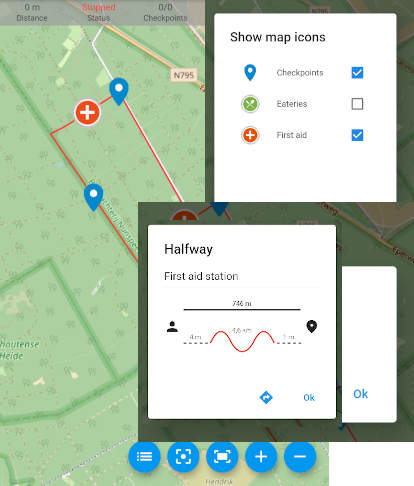

Feature introduction
====================

Any event type
--------------

       
Use *Fast Events* for any type of event (sport events, festivals, congresses, concerts, seminars, your local party, …)

From selling 1 type of ticket with a single entrance scan to an event with multiple tickets, multiple entrances and multiple scans.

Ideal for sporting events with multiple scan checkpoints along the route and a final check to ensure all checkpoints have been scanned.

Take a look at the :doc:`examples <../usage/examples>` to get an idea.

.. raw:: html

   

Tracking
--------

Use the `FE Tracking App <https://fe-tracking.fast-events.eu/>`_ especially for sporting events to allow participants to signal checkpoints
on the route in the App and upload the time at which they pass them to the event organiser's server.

`Realtime tracking <https://player.vimeo.com/video/566996933>`_ display additional points of interest and descriptions on the map, as defined by the event organiser.
Examples include First aid stations along the route, catering facilities along the route, checkpoints along the route, ...

Get real-time track updates and news messages from the event organizer. Load tickets directly into the App from the ``order thank you`` page.

As you walk, cycle, ... share your track with your family and friends so they can see live where you are.

.. raw:: html

   

PDF e-tickets
-------------

Simply define your own e-tickets in your favourite word processor (Word, `LibreOffice <https://www.libreoffice.org/>`_, …)
Upload the PDF file in WordPress via the plugin's management interface and tell *Fast Events* where to print the qrcode-block.

That’s easy isn’t?

.. raw:: html

   

Real-time scanning
------------------

       
No need for expensive scanning equipment. Just use our free `Android <https://play.google.com/store/apps/details?id=nl.fe_data.scanner>`_ and `IOS <https://apps.apple.com/app/fe-scan/id1496549803>`_ app to scan the tickets in real-time at the entrance.

No limit on the number of scan applications running simultaneously.

Staged scans and exit scans are possible and error messages can be tailored to your own event.

How about, sending a “*Thank you for visiting our event*” email after a (exit) scan. Have a look at this :doc:`example <../hooks/scan_ticket>`.

.. raw:: html

   

Payouts next day
----------------

       
*Fast Events* works with the Dutch payment provider `Mollie <https://my.mollie.com/dashboard/signup/5835294>`_.
No recurring fees, you just pay for successful transactions. Competitive rates: e.g. iDEAL is only € 0,29 (excl. VAT) per transaction.
All major payment methods supported. No fees per ticket.

Apply for your free account.

.. image:: ../_static/images/getting-started/Mollie.png
   :target: https://my.mollie.com/dashboard/signup/5835294
   :alt: Mollie

.. raw:: html

   

Admin App
---------

.. image:: ../_static/images/getting-started/fe-admin.png
   :scale: 80%
   :align: left
   :alt: admin-on-the-go
       
Want to view events and orders on your mobile/tablet/desktop? Use the :doc:`FE Admin App <../apps/admin>`.

Resend, refund, delete, re-create tickets or even create orders.

Quickly assist users configuring the :doc:`FE Scanner App <../apps/scan>`.

Or view statistics on tickets sold and tickets scanned and a lot more ...

The system has a comprehensive permissions system where users can have restrictions on functionality and events that can be modified.

.. raw:: html

   

Seating plans
-------------

       
Create your own seating plans for events that require them.

Fill seats in the order you define.

.. raw:: html

   

SaaS mode
-------------

Host multiple organisations on your platform each with their own events. They can use your ticketing platform as sub-merchants.

Add (sub)accounts in the :doc:`FE Admin App <../apps/admin>` and assign selected events to users and where necessary restrict functionality.

Use flexible application fees, which will automatically be transferred to you by `Mollie <https://my.mollie.com/dashboard/signup/5835294>`_.

.. raw:: html

   

REST API
--------

*Fast Events* offers a :doc:`public REST API <../advanced/api>`.
This allows *Fast Events* data to be created, read, updated, and deleted using requests in JSON format and
using WordPress REST API application passwords to grant access.

But you could also create you own scan app by using the :doc:`scan endpoint <../advanced/api-scans>`

Fine grained access control is possible for individual endpoints by using the `Accounts <../usage/tools.html#admin-accounts>`_ tool of the :doc:`FE Admin App <../apps/admin>`

.. raw:: html

   

Webhooks
--------

       
*Fast Events* offers :doc:`Webhooks <../advanced/webhooks>` to sent notifications to a URL of your choice.

You can configure it on a per-event basis and choose what type of notifications you allow to be sent.

Webhooks make it easy for third-party applications to integrate with *Fast Events*.

.. raw:: html

   

Action & filters
----------------

Do you want to extend the functionality of *Fast Events*?

We have a number of filters and actions that allow you to do just that.

Have a look at our :doc:`examples <../hooks/usage>`.

How about a nice :doc:`Google Analytics integration <../hooks/new_order>` that shows you all sales activities in beautiful graphs, and you always have the data at your fingertips.

.. raw:: html

   

Summary
-------
.. hlist::

   - Modern bootstrap based settings interface
   - Fully responsive :doc:`FE Admin App <../apps/admin>` for Android, IOS and Web
   - Event types (single, single selection from many, multiple selection and passe-partout)
   - Native interfaces for many email-providers (PostMark, Mailgun, Amazon, Sendgrid, ...)
   - Optional reCAPTCHA protection
   - REST API
   - Webhooks
   - SaaS mode
   - Actions & filters for custom extensions
   - Flexible stock control
   - Create you own seating plan
   - Design your own PDF e-tickets and invoices
   - Design email confirmations
   - Define  input fields for selling e-tickets
   - Export orders and tickets for offline data analysis (Eg. Excel)
   - Flexible realtime scanning at multiple levels with mobile app.
   - Define e-ticket types
   - Sell to closed user groups
   - Integrated with `Mollie <https://my.mollie.com/dashboard/signup/5835294>`_ as payment provider, providing a variety of payment methods
   - Define your own statuses for orders
   - Authorize parts of the plugin admin pages to other users

Demo data
---------

       
The plugin comes loaded with demo data to give you an instant view of the possibilities.

Give the :doc:`FE Admin App <../apps/admin>` and the :doc:`Scan App <../apps/scan>` a try, add Dashboard orders, …

.. raw:: html

   

 
