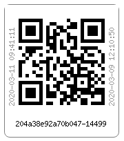
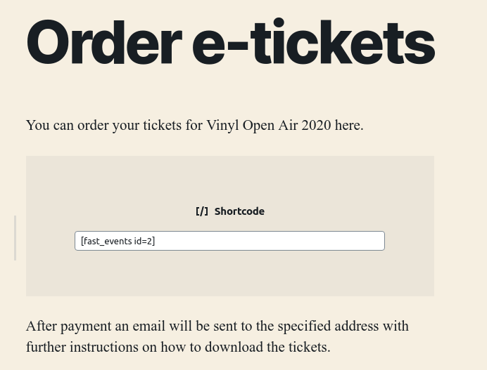
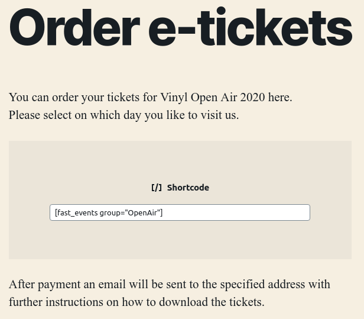

Overview
************
Make sure you have your free Mollie account configured. Without it you can only use RSVP events or sell free etickets (0.00 amount).

To use *Fast Events*, a one-time configuration is required. To do this, go to the :doc:`settings <settings>` of the plugin.
The settings can only be changed by an account with WordPress ``administrator`` rights.

This plugin allows you to sell tickets for different types of events. Per event there are all kinds of possibilities to impose restrictions such as,
time of sale, maximum number of tickets that can be purchased, group membership, purchase once, limit ticket type stock and much more. A few examples

- online sale of etickets for a single event
- sell etickets for a group of events. The user can only choose a single event
- sell etickets for a group of events. The user can select multiple events
- sell a passe-partout. Customers may attend all events in the group
- use it for a bicycle tour with multiple checkpoints for scanning and use the `FE Tracking App <https://fe-tracking.fast-events.eu/>`_
- sell tickets for a theater and use a seating plan

Have look at the detailed :doc:`examples <../usage/examples>` to get an idea what type of event you can create.

----

Checklist for creating an event
-------------------------------
Before you start creating an event, it is a good idea to go through the questions in the checklist below and collect the answers before creating the event.

- The name of the event.
- The exact date and perhaps the starting time
- When will the ticket sale start and when will it end?
- How many tickets are available (stock on event level)?
- Do you need multiple ticket types? Eg. a tickets for adults and a ticket for children, each with a different price and stock. Do they need to be counted (Deducted from the stock)?
- How many tickets can be ordered in a single order?
- Do you want to use volume pricing?
- Are users allowed to place multiple orders?
- Do you need a seating plan?
- Is this an sports event and do you want to use the `FE Tracking App <https://fe-tracking.fast-events.eu/>`_ ?
- Is it a single event or are there multiple events eg. 1 event per day for a series of days?
- Do you need an passe-partout (access to all events for a reduced price)?
- Are there different access-rights for some tickets. Eg. all tickets are scanned at the main-entrance but some ticket types (fi. Backstage) have ‘Backstage’
  access and can be scanned at the Backstage-entrance. Or for sports events, a scan at the start of the route, several scans along the route as checkpoints and a scan at the end.
- Design the email the user receives after a successful order (see `example <../usage/events.html#email-body>`_)?
- Create a “*Thank you for your purchase*” page (See `thank you example <#thank-you-page>`_ below).
- Do you need more information from the user during ordering. Normally only the name and emailaddress are needed.
  Be very careful adding too many fields, as users tend to bailout if they see a huge list of mandatory fields.
- Design your eticket. Do you need different designs per ticket type?
- Scanning of the etickets: are multiple entries used and do you want to measure how many pass a specific entry?
- Do you want to give free tickets to, for example, sponsors?

----

PDF etickets
------------
Customers will receive an email with an unique link to download the etickets as a pdf-file. You have to create a PDF-template which the plugin can use to create the eticket.
This is an `example of a template <../_static/pdf/Vinyl-template.pdf>`_.

How to create a template?
^^^^^^^^^^^^^^^^^^^^^^^^^
Use for example Word, LibreOffice, … and design a single-page A4 e-ticket.
Leave a 120 mm x 40 mm block somewhere on the page. Smaller is possible as you can scale the qrcode-block. You can position it either vertical or horizontal or even in any angle you want.
This is the block where *Fast Events* will print the qrcode block and some other information. Save the design as PDF and upload it to your WordPress Media library.

Recommendations
^^^^^^^^^^^^^^^
Keep the PDF as small as possible, preferable below 200kb for a single eticket. Don’t use full blown images.
Bring them back to an acceptable resolution. And pull the images first through sites like https://kraken.io to squeeze the size.
An image resolution of 150 DPI for etickets is enough.
Make use of use the `PDF system fonts <https://kbpdfstudio.qoppa.com/standard-14-pdf-fonts/>`_.
For example use for your text the ``Helvetica`` font. Try to prevent the use of special fonts, because these are embedded in the PDF and then the PDF becomes larger.
You can analyse your `PDF here <http://pdf-analyser.edpsciences.org/>`_.

----

Thank you page
--------------

.. list-table::

    * - .. figure:: ../_static/images/getting-started/Thank-you.png
           :target: ../_static/images/getting-started/Thank-you.png
           :alt: Example thank you page
           
           An example “Thank you for the purchase” page

Download link
^^^^^^^^^^^^^

It is possible to include a download link for the etickets in the “*Thank you*” page.
It’s up to you to do this in combination with an email or just omit the email
(See `Event settings <../usage/events.html#event-settings>`_, :guilabel:`Emails` checkbox)
and use the download link. You can put that download link anywhere in the “Thank you” page with a shortcode. Use the following shortcode:

.. code-block:: text

   [fe_download showimage="yes" downloadtext="Download eticket(s)"]

You can customize the text of the hyperlink by changing the ``downloadtext`` parameter. The ``showimage`` parameter is only applicable if there is a single (1) eticket.
If you set it to “**yes**” , the qrcode wil be included in the page. This can be useful, for example, for the sale of consumption coins.
You buy the coins on your mobile and show the qrcode on the “*Thank you*” page at the counter and the qrcode can be scanned directly and you receive your coins.
So no queuing at the counter or time consuming payment actions. If there is more than 1 eticket this parameter will be ignored.
Don't use this shortcode together with the ``Event type`` :guilabel:`Select multiple dates`.

       
This is an example qrcode. At the bottom the ticket-id and after the dash the order-id. On the right the date and time the order was created and on
the left the date (and time the page was created.

.. raw:: html

   

----

Order pages
-----------

       
Once you have defined your event(s), you should create one or more order pages, depending on your requirements.
If you just have a single event, use the shortcode-format as shown in the example. The id is the number of the event.

.. code-block:: text

   [fast_event id=2]

.. raw:: html

   

       
Or use this shortcode-format. Your OpenAir festivals is running for 2 days and visitors can attend 1 or more days.
You need to create an event for every day, which are linked together by the group name.

.. code-block:: text

   [fast_event group="OpenAir"]

See ``Event type`` in the `Type settings <../usage/events.html#type>`_ for more explanation.

.. raw:: html

   

Next steps
----------
#. Goto the :doc:`orders menu <../usage/orders>` and add via de the dashboard a new order.
   Make sure you have :guilabel:`Dashboard orders` switched on in the `Event settings <../usage/events.html#event-settings>`_ of the event.
#. Check if the email arrives and if the content is ok.
#. Download the eticket and check it.
#. Use the :doc:`Scan App <../apps/scan>` to scan the eticket.
#. Check in the `Orders popupmenu <../usage/orders.html#orders-popupmenu>`_ the order details if the ticket is scanned.
   You can remove the scan with the ``Checkin`` menu choice in the popupmenu.
#. Now test the orderpage. Make sure you have :guilabel:`Test payments` switched on in the `Event settings <../usage/events.html#event-settings>`__ of the event.
#. Check again the email, eticket and scan the eticket.
#. Do a refund of the last order.
#. Check the stock value.
#. If you are happy with the results, you should remove all orders and tickets via the contextmenu in the
   :doc:`events menu <../usage/events>` and uncheck :guilabel:`Test payments` in the `Event settings <../usage/events.html#event-settings>`__ of the event.
#. Your event is now live.
#. If you have a sports event, you can switch on the :guilabel:`Tracking` in the `Event settings <../usage/events.html#event-settings>`__
   of the event and configure the other tracking fields.

Don't
-----
Once your event(s) has orders you, never change the following fields:

- don't add, remove or change ticket names in the `Ticket types <../usage/events.html#ticket-types>`_. You can change the price and stock.
- don't change the :guilabel:`Link stock event-id` field in the `Stock settings <../usage/events.html#stock>`_.
- don't change :guilabel:`Event type` or :guilabel:`Event group name` in the `Type settings <../usage/events.html#type>`_.
  You may change ``Date`` and/or ``Date format``.
- don't add, remove or change extra input fields in the `Input fields <../usage/events.html#input-fields>`_
- don't change :guilabel:`Scan key`, :guilabel:`Level` and :guilabel:`Scan location` in the `Scan keys <../usage/events.html#scan-keys>`_
- don't change :guilabel:`User groups` in `Groups <../usage/events.html#groups>`_
- don't change the :guilabel:`Seat configuration` in `Seats <../usage/events.html#seats>`_.
  You can add at the end new seats, but you should never remove seats.
