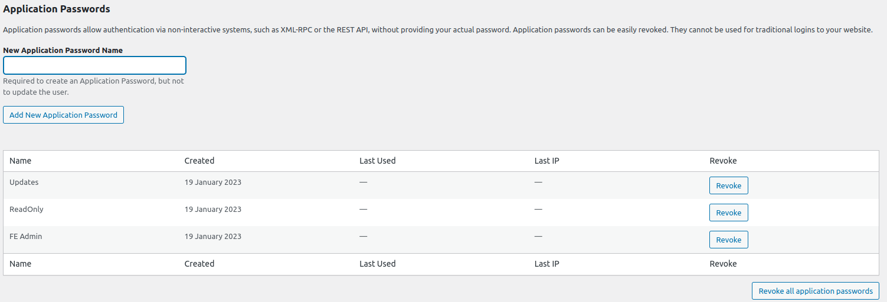

Settings
========
The plugin's settings apply to all events. Before you start selling etickets, make sure that all necessary settings have been entered.

By clicking on the tabs on the left you can change various parts of the settings. Then press :guilabel:`Save` to save the settings.

.. list-table::

    * - .. image:: ../_static/images/getting-started/Settings.png
           :target: ../_static/images/getting-started/Settings.png
           :alt: Event groups

----

Payment provider account
------------------------
*Fast Events* is integrated with `Mollie <https://www.mollie.com/dashboard/signup/5835294>`_ as payment provider, providing a variety of payment options.
As such the plugin is only available for associations/companies residing in a `SEPA country <https://wiki.xmldation.com/Support/EPC/List_of_SEPA_countries>`_.
With Mollie there are no fixed recurring costs, you only pay for successful transactions. The prices are very competitive.
The transactions of, for example, iDEAL (the Netherlands) cost only € 0.29 excluding VAT. Press the button below to create your free Mollie account.

.. image:: ../_static/images/getting-started/Mollie.png
   :target: https://www.mollie.com/dashboard/signup/5835294
   :alt: Mollie

After you have created your free account, you will receive an email from Mollie with your login details. Confirm the email with the button in the email.

Log in to the Mollie dashboard and go through the wizard to enter all data (Your personal info, chamber of commerce id, bankaccount, VAT number (if applicable),
your identification (passport), website where you want use payments and finally the payment methods.
During the process you will be asked to transfer 1 cent from your company’s bank account to prove that you are the owner.

Live API-key and Test API-key
^^^^^^^^^^^^^^^^^^^^^^^^^^^^^
Copy the keys from the Mollie :guilabel:`Dashboard` -> :guilabel:`Developers` into the ``Live API-key`` and ``Test API-key`` fields.

Currency
^^^^^^^^
For example ``€``.

Refund costs
^^^^^^^^^^^^
If you do refunds in the :doc:`Orders menu <../usage/orders>`. This amount is deducted from the reimbursement.

Refund per
^^^^^^^^^^
The refund costs can be per ``Order`` or per ``Ticket``.

Error page
^^^^^^^^^^
The :guilabel:`Error page` is the page where users end up if:

- The customer cancels the payment or if they left the payment-screen open for a long time and it times out. Timeout periods can differ per payment method.
- The customer did pay, but the Payment provider has not yet informed the plugin that the payment succeeded. You can provide a shortcode in the page, so the user can check again if the payment came through. See example below.

.. list-table::

    * - .. image:: ../_static/images/getting-started/Error-page.png
           :target: ../_static/images/getting-started/Error-page.png
           :alt: Error page

SaaS mode
^^^^^^^^^
With SaaS mode, it is possible to use *Fast Events* as a ticketing platform to which multiple organizations. associations, ... can be connected.
Each organization then has its own event(s) and its own WordPress account on the platform.
If you want to start using this mode you will first have to register your Application (= *Fast Events* ) once in the
`Mollie Dashboard <https://www.mollie.com/dashboard/signup/5835294>`_ via the menu Developers->Apps. When entering the data, the ``Redirect URL`` should look like this ``https://example.com/wp-json/fast-events/v1/saas/authorize``.
Once the registration is complete, the :guilabel:`Client-ID` and :guilabel:`Client-secret` can be entered below.

Steps required to connect a new organization to the platform:

1. Create a WordPress account for the new organization. The user must not have the ``Admin`` role.
2. Add the events for this organization and under the :guilabel:`SaaS user` in the `Basics tab <../usage/events.html#basics-tab>`_ select the username created under step 1.
3. If necessary, change the sender in the `Email tab <../usage/events.html#email-tab>`_. Verify that the email provider being used can work with this new sender.
4. Create `authorization rules <#authorization-settings>`_ in the settings and limit usage to the event ids defined in step 2.
5. The client must create a new Website profile in the `Mollie Dashboard <https://www.mollie.com/dashboard/signup/5835294>`_ via the Settings->Website Profiles menu. This should use the domain on which *Fast Events* is hosted.
6. The customer can now log in once in *Fast Events* or via the :doc:`FE Admin App <../apps/admin>` to authorize the platform to process payment information on behalf of the customer.
7. Agree the application fee with the client. Below you can specify this for all organizations, but it can be changed for each event.
   This fee is automatically retained by `Mollie <https://www.mollie.com/dashboard/signup/5835294>`_ and assigned to the service provider hosting *Fast Events*.

Client ID
^^^^^^^^^
The ID you got when registering the App. It usually starts with ``app_``.

Client secret
^^^^^^^^^^^^^
The secret you got when registering the App.

Client fee
^^^^^^^^^^
This is the fee (including VAT) that Mollie retains and allocates to whoever hosts the *Fast Events* plugin in SaaS mode.

Client fee per
^^^^^^^^^^^^^^
The fee can be per order or per ticket.

----

Email settings
--------------

Email-server type
^^^^^^^^^^^^^^^^^
If you choose ``Host email`` then it is sufficient to fill in the :guilabel:`Sender name` and :guilabel:`Sender email`.
This setting is the default after installation of the plugin.

But choosing the right :guilabel:`Email-server type` depends to a large extent on how many emails can be sent per day.
Check with you hosting provider how many emails you can send per day (or any other period) and compare this with how many orders (= 1 email) you expect per day.
If the expected amount is more than you can send per day you have to go back to your hosting provider to check if you can upgrade your hosting-package with more emails?
Or you can use professional companies that can send your email, such as `Amazon SES <https://aws.amazon.com/ses/>`_, `Mailgun <https://www.mailgun.com/>`_,
`Sendgrid <https://sendgrid.com/>`_, `Postmark App <https://postmarkapp.com/>`_, … and many more. If you go down this path, you can choose for
the other :guilabel:`Email-server type` options. ``SMTP`` is always possible for all email providers, but we have a number of native implementation as well,
which are the faster counterpart of SMTP as this is a rather ‘*chatty*’ protocol.

Sender name and email
^^^^^^^^^^^^^^^^^^^^^
The name and emailaddress you recipients will see in the received tickets email.

Email retries
^^^^^^^^^^^^^
*Fast Events* can be configured to keep retrying to send new order emails. Checking this option is only wise if you are using SMTP or one of the native APIs.
The ``Host email`` solution uses the MTA on the host itself and, if everything is configured correctly, will never return an error.
With ‘Host email‘ possible hard-bounces (for example: emailaddress doesn't exists) or soft-bounces (for example: mailbox full) will be send back to the sender (Send email).

With SMTP or the native API’s there can be errors. For example the host may be (temporary) unreachable, too many request per time-period, … Consult you API provider for other possible errors. In case of errors you have 2 options:

#. Use the :doc:`fast_events_email_api_result <../hooks/email_api_result>` webhook to inform the WordPress Admin (or another user) that something went wrong
#. Check the checkbox :guilabel:`Email retries` and *Fast Events* will retry sending the email to the SMTP or API-provider again.
   It will use the ``Retry scheme`` to schedule the next retry.

Retry scheme
^^^^^^^^^^^^
The default value is ``2,4,8,16,32,64,128``, which means the first retry is scheduled after 2 minutes, and then 4 minutes, and so on.
You can define your own scheme.

Consult you SMTP or API provider how it handles hard-bounces and soft-bounces. Usually they provide webhooks to process these bounces.
     
SMTP settings
^^^^^^^^^^^^^
**Host email**
   Check this box if you want use your hosting platform the send emails
**Email server**
   The name of the server. Check with your email-provider.
**User**
   Most of the time this takes the form of an emailadress. Check with your email-provider.
**Password**
   The password of the account. Check with your email-provider.
**Verify peer**
   Disabling it and you’ll be vulnerable to a Man-in-the-Middle Attack. Incidentally you may disable it if you are fi. testing with an internal SMTP host with a self-signed certificate.
**Port number**
   Most of the time port ``465`` or ``587`` is used. Check with your email-provider.
**Security protocol**
   Use ``ssl`` or ``tls``. Check with your email-provider.

Amazon SES API settings
^^^^^^^^^^^^^^^^^^^^^^^
The settings can be found in the `Amazon console dashboard <https://console.aws.amazon.com/>`_.
If you still need to create a SES account, make sure you create it in the ``EU`` region as the plugin is only supported in the `European SEPA countries <https://wiki.xmldation.com/Support/EPC/List_of_SEPA_countries>`_ if online payments are used.
You can find/create in the Amazon IAM (Identity and Access Management) menu the :guilabel:`Access key` and :guilabel:`Secret key`. Make sure the secret key has the right permissions to send email.

Mailgun API settings
^^^^^^^^^^^^^^^^^^^^
The settings can be found in the `Mailgun dashboard <https://www.mailgun.com/>`_. If for example your domain is ``somedomain.com``. The server URL would be:

.. code-block:: html

   https://api.eu.mailgun.net/v3/mg.somedomain.com/messages
   
If you create a new sending domain, make sure you create it in the ``EU`` space of Mailgun as this plugin can only be used by the
`European SEPA countries <https://wiki.xmldation.com/Support/EPC/List_of_SEPA_countries>`_.
If you don’t host your domain in the European union (USA flag in dashboard), you have to strip the ``eu`` part from the URL.
This of course will also works, but it adds some latency to the API request. The ‘mg‘ part depends on your DNS settings.

Mailjet API settings
^^^^^^^^^^^^^^^^^^^^
The settings can be found in the `Mailjet dashboard <https://www.mailjet.com/>`_. The URL for the server is:

.. code-block:: html

   https://api.mailjet.com/v3.1/send
   
The :guilabel:`Mailjet API key` is the combination of the user identifier and API key, separated by a colon. For example ``7a8e12:1234a1``

Postmark API settings
^^^^^^^^^^^^^^^^^^^^^
The settings can be found in the `Postmark dashboard <https://postmarkapp.com/>`_. The URL for the server is:

.. code-block:: html

   https://api.postmarkapp.com/email
   
Sendgrid API settings
^^^^^^^^^^^^^^^^^^^^^
The settings can be found in the `Sendgrid dashboard <https://sendgrid.com/>`_. The URL for the server is:

.. code-block:: html

   https://api.sendgrid.com/v2/mail/send
   
Sendinblue API settings
^^^^^^^^^^^^^^^^^^^^^^^
The settings can be found in the `Sendinblue dashboard <https://www.sendinblue.com/>`_. The URL for the server is:

.. code-block:: html

   https://api.sendinblue.com/v3/smtp/email
   
Sparkpost API settings
^^^^^^^^^^^^^^^^^^^^^^
The settings can be found in the `Sparkpost dashboard <https://www.sparkpost.com/>`_. The URL for the server is:

.. code-block:: html

   https://api.eu.sparkpost.com/api/v1/transmissions
   
If you create a new sending domain, make sure you create it in the ``EU`` space of Sparkpost as this plugin can only be used by the `European SEPA countries <https://wiki.xmldation.com/Support/EPC/List_of_SEPA_countries>`_.
If you don’t host your domain in the European union, you have to strip the ``eu`` part from the URL. This of course will also works, but it adds some latency to the API request.

----

ReCAPTCHA settings
------------------
At RSVP events it can of course occur that sick minds spam you with all kind of different real or bogus emailaddresses, even if you have confirmations enabled.
Worse, they may give you a bad reputation, and receiving domains can flag you as spammer. For these cases you can use `Google reCAPTCHA <https://developers.google.com/recaptcha/>`_.
Sign in and setup up your domain; *Fast Events* only supports v2 at the moment. Once setup, copy the keys to the :guilabel:`Site key` and :guilabel:`Secret key`.
Switch on the :guilabel:`ReCaptcha` flag in the `Basics tab <../usage/events.html#basics-tab>`_ and the booking screen will have a ReCaptcha.

----

Settings for instant payments
-----------------------------
These settings work together with the :doc:`Payment app <../apps/payment>`.
The app generates a qrcode which the customer can scan with the camera or a banking app (Netherlands and Belgium) to make a payment.
The ‘*Payment app*’ shows immediately if a payment succeeded or not.

Event-id
^^^^^^^^
This is the id of a special event you have to define. The event is just used for reporting purposes. Set the following fields:

- Basic tab
   - ``Name`` "*Online payments*". You can of course translate this.
   - ``Available start/end date`` make the window large enough
   - ``Stock`` 0
   - ``Redirect after booking`` Set a valid URL to thank the user for the payment
   - Don’t use the other settings
- Type tab
   - ``Event type`` No date
   - ``Group type`` No group
- 'Email tab' and 'Confirmation email tab': don’t use
- 'Input tab': add 2 text-fields ``Account`` and ``Description``. Do **not** translate these fields

Minimum amount
^^^^^^^^^^^^^^
The minimum amount to use for a payment with a qrcode. If you enter a lower value in the app, an error will be returned an no qrcode is generated.

API key
^^^^^^^
The secret key the :doc:`Payment app <../apps/payment>` has to use to secure the communication.
You can use the button to generate a new secure token.
Copy the qrcode and send it as an attachment in an email to the users of the Payment App.
Users can than “*Share*” the qrcode with the Payment App to configure it.

Or they can scan the qrcode to configure the :doc:`Payment app <../apps/payment>`.

----

REST API settings
-----------------
These settings work together with the :doc:`FE Admin App <../apps/admin>` and the :doc:`Public API <../advanced/api>`.
The App can be used on your mobile (for now only on Android) to view the basic information of events and orders.
But you can also resend orders, refund, configure the scan app or payment app, and much more …

API key
^^^^^^^
The secret key the :doc:`FE Admin App <../apps/admin>` has to use to secure the communication.
You can use the button to generate a new secure token.
If printed or shown, users can scan it with the camera to configure a new server in the app.

----

Authorization settings
----------------------
In the standard installation, only admin users can change all parts of the *Fast Events* plugin, which is usually good enough.
But there may be situation where you want to delegate some functionality to non-admin users.
The pre-condition is that users need to have an account on your WordPress site with valid login credentials.

Per line you can specify which user is authorized for which actions. Its format is:

.. code-block:: text

   emailaddress[event_ids](AppName):controller1(action1|action2|...),controller2(action3|action4|...),...
   
The ``[event_ids]`` part is optional. It limits the scope of the authorisation to a predefined set of events identified by the event_id, e.g. ``[1,3]``.

The ``AppName`` part is also optional. It must resemble the name of the *Application Password* defined for this user.
This optional part allows you to create multiple application passwords for a single WordPress account used by different end users of the FE Admin application, each with their own authorisation settings.
For example:

.. code-block:: text

  John@doe.com(ReadOnly):admin(event_read|order_read)
  John@doe.com[1,3](Updates):admin(event_read|order_read|order_email|order_update|order_refund)
  John@doe.com:admin(*)

This is the associated application password block when you change a user via the WordPress admin panel:

.. note::  If you use this feature, make sure you first define the rules using the optional ``AppName``. The ``AppName`` is **not** case-sensitive.

The following controllers and actions are available. If you want to grant all actions of a single controller, you can also specify a ***** (asterisk):

Settings controller
^^^^^^^^^^^^^^^^^^^

- ``read`` All settings can be read
- ``write`` Settings can be saved

Errorlog controller
^^^^^^^^^^^^^^^^^^^

- ``read`` Read the errorlog

Events controller
^^^^^^^^^^^^^^^^^
- ``add`` Add new events
- ``bulk_copy`` Copy changes from 1 event to many other events
- ``duplicate`` Duplicate events
- ``example_invoice`` Create an example invoice
- ``example_ticket`` Create an example ticket
- ``export`` Export events and related pages and templates
- ``firebase`` Access to Firebase for creating accounts and realtime messages
- ``import`` Import events and related pages and templates
- ``kml_upload`` Upload KML-files for tracking
- ``map`` Show tracks on a map including checkin numbers for all checkpoints
- ``read`` Read events
- ``remove_all`` Remove all orders from an event
- ``set_zero`` Set all counters to zero
- ``test_email`` Send test emails
- ``update`` Change events
- ``user_group_delete`` Delete user groups
- ``user_group_read`` Read closed user groups
- ``user_group_upload`` Upload new user groups

Tools controller
^^^^^^^^^^^^^^^^
- ``email`` Send free format emails
- ``orders`` Resend order confirmation emails
- ``refund`` Refund orders

Qrcode controller
^^^^^^^^^^^^^^^^^
- ``admin_app_change`` Change the qrcode for the Admin App
- ``admin_app_read`` Read the qrcode for the Admin App
- ``payment_app_change`` Change the qrcode for the Payment App
- ``payment_app_read`` Read the qrcode for the Payment App
- ``scan_app_change`` Change the qrcode for the Scan App
- ``scan_app_read`` Read the qrcode for the Scan App

Orders controller
^^^^^^^^^^^^^^^^^
- ``change_email`` Change the user credentials
- ``create_tickets`` Create new tickets
- ``custom_status`` Set a custom status
- ``dashboard_order`` Add new orders
- ``delete`` Delete an order
- ``delete_tickets`` Delete the tickets of an order
- ``download_invoice`` Download the PDF invoice
- ``download_tickets`` Download the PDF tickets
- ``email`` Resend the order by email
- ``read`` Read orders
- ``refund`` Refund the order

Webhooks controller
^^^^^^^^^^^^^^^^^^^
- ``add`` Add new webhooks
- ``delete`` Delete webhooks
- ``duplicate`` Duplicate a webhook
- ``ping`` Ping a webhook consumer for debugging purposes
- ``read`` Read webhooks
- ``reset`` Reset webhook counters
- ``update`` Update existing webhooks

Admin controller
^^^^^^^^^^^^^^^^
Used by the :doc:`Admin app </apps/admin>` and the :doc:`REST API </advanced/api>`.

- ``event_add`` Add events
- ``event_delete`` Delete events
- ``event_read`` Read events
- ``event_sync`` Sync events with each-other
- ``event_update`` Change stock of events
- ``input_fields_change`` Add/update/delete input fields
- ``input_fields_read`` Read input fields
- ``order_add`` Add new orders
- ``order_delete`` Delete an order
- ``order_email`` Resend the order confirmation
- ``order_export`` Export orders in csv format
- ``order_read`` Read orders
- ``order_refund`` Refund an order
- ``order_update`` Change the user credentials or custom status of the order
- ``payment_app_change`` Change the qrcode for the Payment App
- ``payment_app_read`` Show the qrcode for the Payment App
- ``pdf_template_read`` Read PDF templates
- ``pdf_template_change`` Change PDF templates
- ``scan_app_change`` Add/update/delete/renew the qrcode for the Scan App
- ``scan_app_read`` Show the qrcodes for the Scan App
- ``ticket_types_change`` Add/update/delete ticket types
- ``ticket_types_read`` Read ticket types
- ``tickets_create`` Create new tickets for the selected order
- ``tickets_delete`` Delete the tickets from the order
- ``tickets_export`` Export tickets in csv format
- ``tickets_read`` Show the tickets from the order
- ``total_sales`` Overview of total sales
- ``total_scans`` Overview of all scans

Pay_app controller
^^^^^^^^^^^^^^^^^^
- ``create`` Create a new direct payment

Suppose you want to give a customer services representative the option to see orders details, resend the confirmation, change credentials en refund orders, the authorization line would be:

.. code-block:: text

   any_email@domain.com:orders(details|email|change_email|refund)

----

Action scheduler
----------------
*Fast Events* uses the *Action scheduler* for delivering webhook information, retries to send emails and timed RSVP events.

Do not make any changes to these parameters until you have a good understanding of how the *Action scheduler* works and the consequences of the changes.
You can find `here more information <https://actionscheduler.org/perf/>`_ for a detailed explanation. In case you do fully understand it, make the changes and test!

Bear in mind that the *Action scheduler* can be used by multiple plugins. Make sure to know how these plugins interact with the *Action scheduler*.

The defaults will do fine for small events, but if you have an event with thousands of orders in a short time frame or scanning requests **and** webhook consumers for these events, you may consider different settings.

**Purge days**
   After 30 days completed actions will be removed from the logs. With the *Fast Events* plugin you could bring this value down to a lower level.
   Check for the longest retry schedule you use in sending your email, in webhooks or timed RSVP events. But also check other plugins using the *Action scheduler*, if any.
**Time limit**
   Most shared hosting environments allow a maximum of 30 seconds execution time for a job. If this is different in your situation you can change this.
   But don't forget: long running actions also tie up resources for a long time!
**Batch size**
   By default if a queue starts running it processes 25 actions. This means with the previous parameter ``Time limit``, that the system has 30 seconds to process the 25 actions.
   But the actions issued by *Fast Events* should finish in a fraction of a second. If you hook up new webhook consumers tell them to return a HTTP 200 response as soon as possible and
   not do first all kinds of processing and then return a HTTP 200. If you switch on logging for a webhook, you can find the full analysis of the webhook including the ``duration``.
   If this is close to 1 second or even bigger, then there is a serious issue.
**Concurrent batches**
   The default is 1. You could increase this, but before you do make sure your webhook consumers can coop with multiple simultaneous connections. This parameter works together with the next one.
**Additional runners**
   Because the *Action scheduler* is only triggered at most once every minute by WP Cron, it rarely happens that multiple concurrent batches are running at the same time.
   With this parameter you can force *Action scheduler* to start additional queues at the same time.

----

Miscellaneous settings
----------------------
**Custom order statuses**
   A list of custom statutes separated by a comma. The length of a single status should be 32 characters or less. You can use the custom status fields in the contextmenu of the order-table.
   Fi. use it as reminder for calling back a customer after an earlier call. For example, the field could be filled with ``callback,call finished``.
   You can then easily find the actions by sorting on this field in the order table.

   But you can also use it if you occasionally want to sell a book or whatever. Then use, for example, the statuses ``processing, shipped``.
   You can then send the customer an email update with the custom filter :doc:`fast_events_custom_status <../hooks/custom_status>` if the status has changed.
   A simple solution if you do this occasionally, but if it is more structural then a solution like `WooCommerce <https://wordpress.org/plugins/woocommerce/>`_ is recommended.
**Use own domain in Deeplink**
   In case of a sporting event and if the `FE Tracking App <https://fe-tracking.fast-events.eu/>`_ is used for passing checkpoints,
   a link can be clicked in the *'Thank-you'* page directly after the order, to load the ticket into the App.
   This link can be added with a `shortcode <overview.html#deeplink>`_. If this link is clicked on an Android or Apple phone, the FE Tracking App will open and the ticket will be added.
   If the App is not installed, you will first be asked to install it.

   If the link is clicked on a desktop PC, the default display is `https://fast-events.eu/add-ticket <https://fast-events.eu/add-ticket>`_.
   This page indicates that the link can only be clicked on a phone.

   If this parameter is checked, it is possible to create a page on your own domain with its own content in the local language.
   For example ``https://exampledomain.com/add-ticket``.

   .. note::  Make sure the page slug is always ``add-ticket``.

**Use ordering API**
   Use the Ordering API added for generating order forms and order status forms, so that the client frontend can be integrated with other, non WordPress, development environments.
   See `ordering API <../advanced/api-ordering.html>`_ for the specification.
**Cache time orderscreen**
   Optional specify how many seconds the orderform needs to be cached. This option is not using WordPress as cache, but relies on an intermediate cache like Cloudflare or others.
   For example, if you specify 60 (=60 seconds), an HTTP header is generated such as: ``Cache-Control: public, max-age=60, s-max-age=60``.
**Ordering shortcodes**
   Per line you can specify which token should use which shortcode:

   .. code-block:: text

      token:shortcode

      Example
      =======
      vintage:[fast_events id=2]
      cycle:[fast_events group="fast"]
      status2:[fe_download showimage="yes" downloadtext="Download tickets"]
      status3:[fe_ticket downloadtext="Download eticket in FE Tracking App"]

   The tokens **vintage** and **cycle** can be used in the ordering API to generate the orderform. You can then embed this orderform in your own frontend.
   To get it working, you also need the ``fe-payment.js`` or ``fe-payment.min.js`` library, which is part of the Fast Events plugin.
   The library is 100% javascript and has no other dependencies.

   You can also query the order status by using the order uid.
   The API checks to which event id the order belongs and then looks for a token that starts with 'status' supplemented with the event id.
   So for example 'status2'.

   The order status lines are **optional**. If not present the default is ``[fe_download showimage="no" downloadtext="Download tickets"]``

